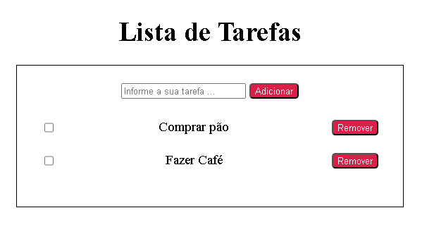
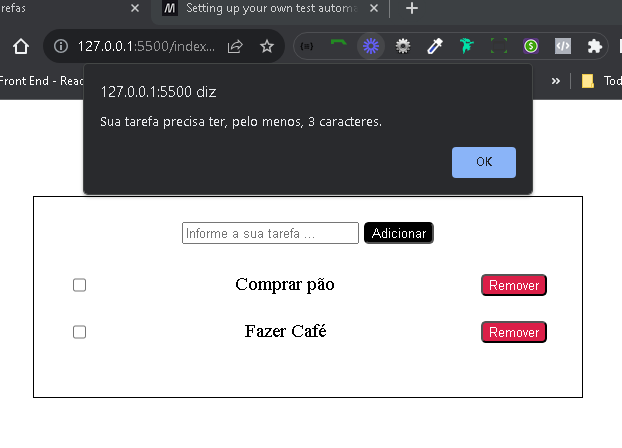

# Projeto de estudo ADA : Lista de Tarefas

- Adicionando elementos por javascript, utilizando CreateElement.
- Adicionando eventos por javascript, utilizando addEventListener.
- Adicionando estilos por javascript, utilizando a tag style.
- Salvando e excluido um elemento no LocalStorage do navegador;
- Criando alerta personalizado para verificação do tamanho do input

